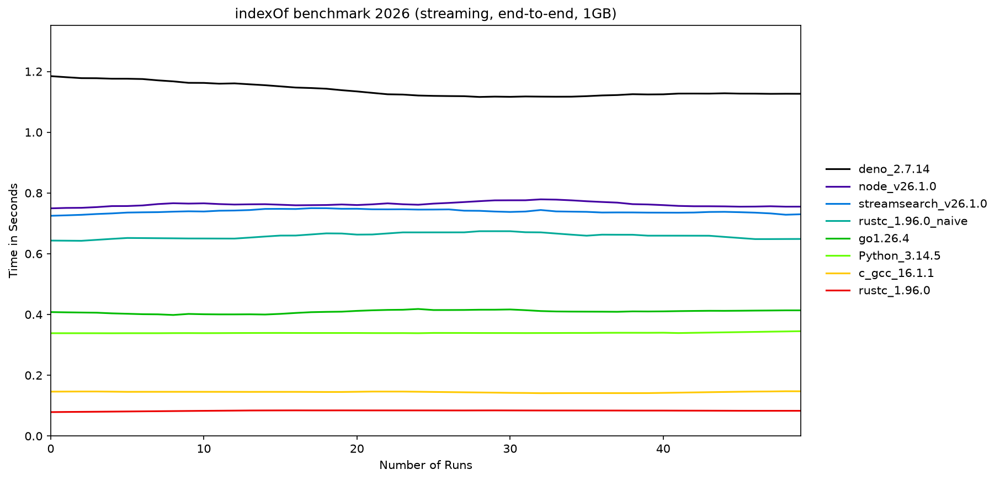

# benchmark-indexof

Benchmarks of the same task — finding a byte pattern (`--boundary--`) in a large binary file — implemented in Node.js, Deno, Python, Go, Rust, and C, plus Node's [streamsearch](https://github.com/mscdex/streamsearch) (the streaming Boyer-Moore-Horspool search used by Busboy/Multer).

### Questions
1. Is the same function or action faster in other languages?
2. Is it worth migrating an application to a different language to improve speed?


## The current benchmark

All implementations solve the **same problem**: stream the file in 64KiB chunks, search each chunk with the language's idiomatic optimized substring search, and handle needles that straddle chunk boundaries (by carrying over the last `needle_len - 1` bytes).

| Language | Search used |
|---|---|
| C | glibc `memmem`, built with `-O2` |
| Rust | `memchr::memmem` (idiomatic) — plus `indexof_naive`, the original naive search kept to show the algorithm-vs-language effect |
| Go | `bytes.Index` |
| Node.js | `Buffer.indexOf` |
| Deno | `@std/bytes` `indexOfNeedle` (Deno 2.x APIs) |
| Python 3 | `bytes.find` |
| streamsearch | streaming Boyer-Moore-Horspool (SBMH) |

Two measurement modes:

1. **End-to-end streaming** (`npm run start`) — hyperfine times the whole process, 50 runs, 3 warmups. This answers "how fast is the whole job", but note it is largely memory-bandwidth-bound once the file is in page cache, and includes runtime startup (measure that separately with `npm run startup`).
2. **In-memory search** (`npm run mem`) — each implementation loads the first 256MiB into memory and times only the search (10 repetitions, timed in-language). This isolates the actual substring-search cost and answers question 1 directly, reporting GiB/s throughput.

### Constraints
- Chunk size is 65536 bytes (Node's default `highWaterMark`).
- The file is random bytes with `--boundary--` appended near the end, so every implementation must scan the whole file (worst case). Default size is **1GB** (set `FILE_SIZE=10G` before `npm run create` to reproduce the original 10GB setup).
- Toolchain versions are detected at runtime and recorded in the result filenames — nothing is hardcoded.

## Instructions

Requires: `node`, `deno` (2.x), `go`, `rustc`/`cargo`, `gcc`, `python3`, `hyperfine`, and Python `matplotlib`+`numpy` for plotting.

```bash
npm run create    # generate sample_file/file.bin (FILE_SIZE=10G to make it bigger)
npm run check     # verify toolchains are installed
npm run build     # build the C, Rust and Go binaries
npm run start     # end-to-end streaming benchmark (hyperfine)
npm run mem       # in-memory search benchmark (isolates search cost)
npm run startup   # runtime startup baseline (node/deno/python no-op)
npm run plot      # plot whatever results exist
npm run plot-all  # plot results across Node versions (requires fnm)
```

Set `TIMES=N` to change the number of hyperfine runs (default 50).

## Results (July, 2026)

Measured 2026-07-06 on AMD Ryzen 9 5950X, Arch Linux, 1GB file, 50 runs, warm page cache.
Faster is better — **top = better, lower = worse**.

### End-to-end streaming (mean time, hyperfine)

```
rustc 1.96 (memmem)      ▏███ 0.083 s        ← fastest
c gcc 16.1 (-O2)         ▏█████ 0.145 s
python 3.14.5            ▏███████████ 0.339 s
go 1.26.4                ▏██████████████ 0.409 s
rustc 1.96 (naive 2022)  ▏██████████████████████ 0.659 s
streamsearch (node 26)   ▏█████████████████████████ 0.740 s
node 26.1.0              ▏█████████████████████████ 0.762 s
deno 2.7.14              ▏██████████████████████████████████████ 1.137 s   ← slowest
```

<p align="center">

</p>

The naive-Rust bar is the key exhibit: the same language with hand-rolled search is **8× slower** than idiomatic Rust (`memchr::memmem`) —  "Rust is slow..." conclusion was the algorithm, not the language.

### In-memory search throughput (256MiB, search cost only)

```
c (glibc memmem)         ▏████████████████████████████████████████ 108.8 GiB/s
rust (memchr::memmem)    ▏████████ 21.4 GiB/s
go (bytes.Index)         ▏████ 10.6 GiB/s
python (bytes.find)      ▏██ 4.4 GiB/s
node (Buffer.indexOf)    ▏█ 3.9 GiB/s
deno (@std/bytes, JS)    ▏▏0.73 GiB/s
```

Runtime startup baseline (no-op process): node 17ms, python 21ms, deno 33ms.

## Reading the results

- Expect the **end-to-end** numbers to cluster: with a warm page cache the job is bound by memory bandwidth plus per-chunk overhead, not by language speed.
- The **in-memory** numbers are where languages actually differ — and mostly they reflect which substring-search algorithm the standard library ships, since all the fast ones (glibc `memmem`, `memchr`, `bytes.Index`, `bytes.find`, `Buffer.indexOf`) are compiled, vectorized code.
- Compare `rustc_*` vs `rustc_*_naive` to see how much the algorithm choice matters — this single difference explains the 2022 "Rust is slow" result.
- streamsearch pays extra to be *correct on streams* (matches spanning chunks) and to report match positions incrementally; that's the price Busboy/Multer pay.
